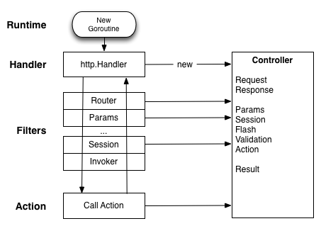

Revel 是一个功能齐全的 Web 框架，继承了 Rails 或 Play!
Framework 的精髓。许多很好的（久经考验的）想法被整合到了本框架的设计和接口中。

Revel 使用了模型-视图-控制器(MVC)设计模式，并通过约定好的代码结构，让 Web 应用开发更加的简单。这样可以减少程序的配置，并且极大地缩短了开发周期。

## MVC

这里是个大概的总结：

- *Models* 是用来描述应用程序所需数据的对象。
   Models 也包含专门用于数据查询和更新的逻辑代码。
- *Views* 用于描述数据如何被呈现和修改。在这里，我们使用模板向用户展示数据及对数据的操作方法。
- *Controllers* 用来处理请求。他们执行用户期望的动作，决定哪个视图被呈现，并为视图的渲染提供必要的数据。

网上有许多关于 MVC 的优秀论述。其中，由[Play! Framework](http://www.playframework.org)提供的论述能够很好的匹配我们的模型。

## Request 的生命周期

这里是请求处理框架的概览。

概念摘要：

* Revel exposes a single http.Handler, responsible for instantiating the
  Controller (the context for the request) and passing the request along to the
  Filter Chain.
* Filters are links in a request processing chain. They may be composed to
  implement horizontal concerns like request logging, cookie policies,
  authorization, etc.  Most of the built-in functionality is implemented as
  Filters.
* Actions are the application-specific functions that process the input and
  produce a Result.

## HTTP Handler

Revel builds on top of the Go HTTP server, which creates a go-routine
(lightweight thread) to process each incoming request.  The implication is that
your code is free to block, but it must handle concurrent request processing.

The Revel handler does nothing except hand the request to the Filter chain for
processing and, upon completion, apply the result to write the response.

By default, the Revel handler will be registered on `"/"` to receive all
incoming connections.  However, applications are free to override this behavior
-- for example, they may want to use existing http.Handlers rather than
re-implementing them within the Revel framework.  See the [FAQ](faq.html) for
more detail.

## Filters

[Filters](filters.html) implement most request processing functionality provided
by Revel. They have a simple interface that allows them to be nested.

The "Filter Chain" is an array of functions, each one invoking the next, until
the terminal filter stage invokes the action.  For example, one of the first
Filters in the chain is the `RouterFilter`, which decides which Action the
request is meant for and saves that to the Controller.

Overall, Filters and the Filter Chain are the equivalent of Rack.

## Controllers and Actions

Each HTTP request invokes an **action**, which handles the request and writes
the response. Related **actions** are grouped into **controllers**.  The
[Controller](../docs/godoc/controller.html#Controller) type contains relevant
fields and methods and acts as the context for each request.

As part of handling a HTTP request, Revel instantiates an instance of your
Controller, and it sets all of these properties on the embedded
`revel.Controller`.  Revel does not share Controller instances between requests.

***

A **Controller** is any type that embeds `*revel.Controller` (directly or indirectly).

<pre class="prettyprint lang-go">
type AppController struct {
  *revel.Controller
}
</pre>


An **Action** is any method on a **Controller** that meets the following criteria:
* is exported
* returns a revel.Result

For example:

<pre class="prettyprint lang-go">
func (c AppController) ShowLogin(username string) revel.Result {
	..
	return c.Render(username)
}
</pre>


The example invokes `revel.Controller.Render` to execute a template, passing it the
username as a parameter.  There are many methods on **revel.Controller** that
produce **revel.Result**, but applications are also free to create their own.

## Results

A Result is anything conforming to the interface:

<pre class="prettyprint lang-go">
type Result interface {
	Apply(req *Request, resp *Response)
}
</pre>

Typically, nothing is written to the response until the **action** and all
filters have returned.  At that point, Revel writes response headers and cookies
(e.g. setting the session cookie), and then invokes `Result.Apply` to write the
actual response content.
