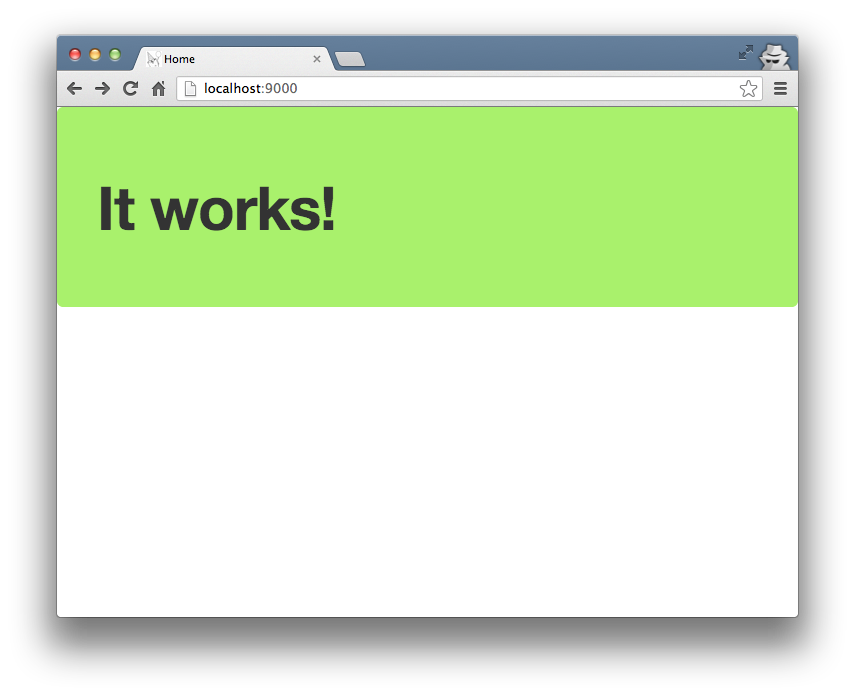

使用 Revel 命令行工具在 GOPATH 中创建一个空的 Revel 工程并运行它：

	$ cd $GOPATH

	$ revel new myapp
	~
	~ revel! http://revel.github.io
	~
    Your application is ready:
        /Users/revel/code/gocode/src/myapp

    You can run it with:
        revel run myapp

	$ revel run myapp
	~
	~ revel! http://revel.github.io
	~
	2012/09/27 17:01:54 run.go:41: Running myapp (myapp) in dev mode
	2012/09/27 17:01:54 harness.go:112: Listening on :9000

打开浏览器访问 http://localhost:9000/ 会看到你的程序已经正确执行。

生成的工程目录结构在[这里](../manual/organization.html)有介绍。

**下一篇： [学习 Revel 如何处理请求](requestflow.html)**
