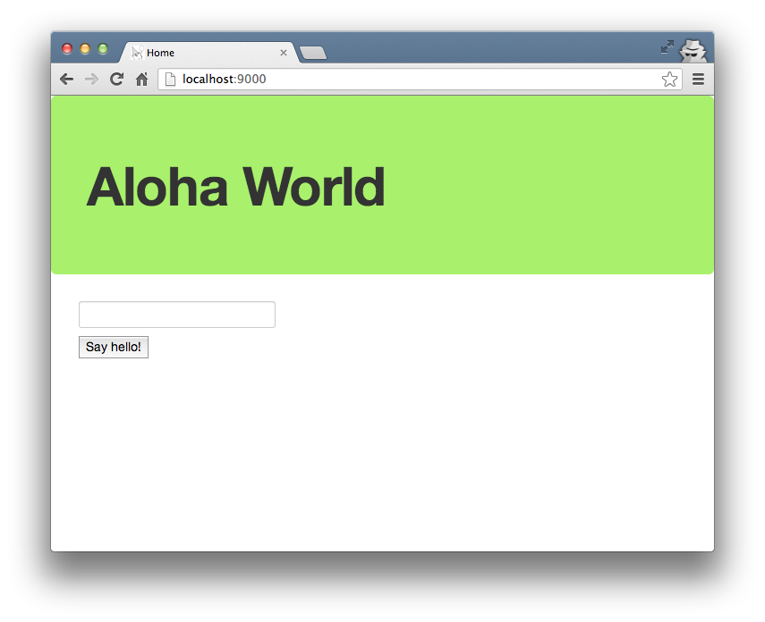
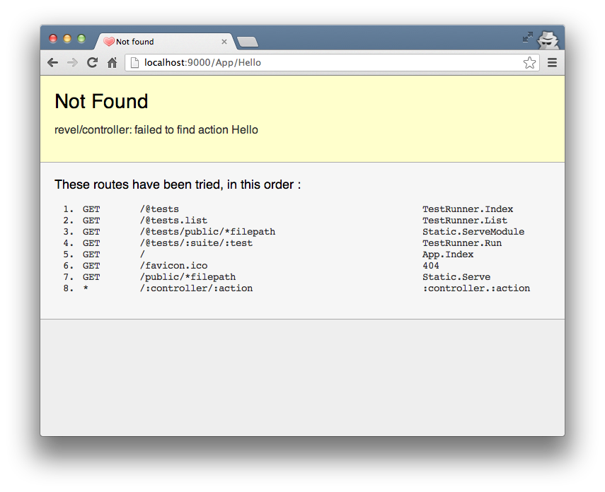
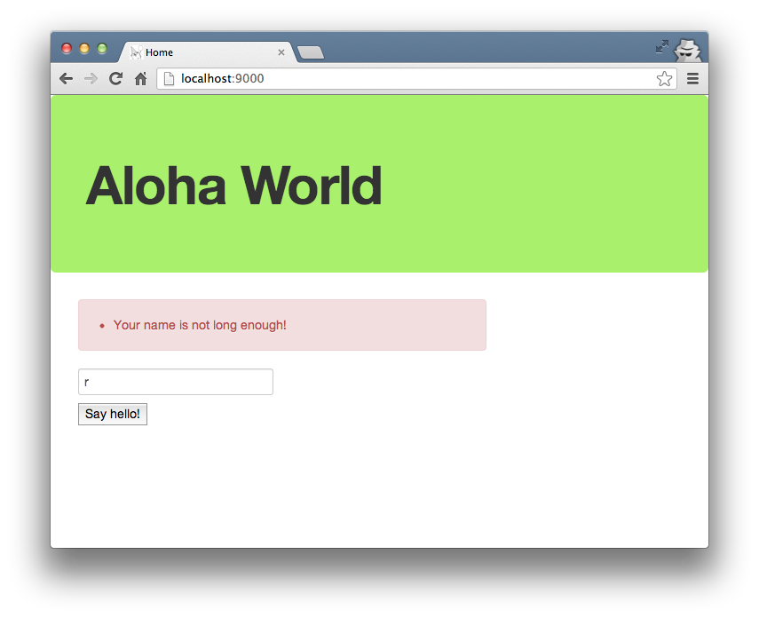

这篇文章内容借鉴于[the Play! example](http://www.playframework.org/documentation/1.2.4/firstapp)的"Hello World"练习。

首先，打开[我们之前创建](createapp.html)的工程 **myapp**。

编辑 **app/views/App/Index.html** 模板，在包含`flash.html`模板的代码的下面添加以下表单：

	<form action="/App/Hello" method="GET">
	    <input type="text" name="myName" /> 
	    <input type="submit" value="Say hello!" />
	</form>

运行工程，可以看到我们的改动：

我们尝试提交些内容：

这是意料之中的。在 **app/controllers/app.go** 中增加以下动作：

	func (c App) Hello(myName string) revel.Result {
		return c.Render(myName)
	}

然后，我们要创建一个视图（view）。创建文件 **app/views/App/Hello.html**，并输入以下内容：


	{{set . "title" "Home"}}
	{{template "header.html" .}}

	<h1>Hello {{.myName}}</h1>
	<a href="/">Back to form</a>

	{{template "footer.html" .}}


刷新页面，你应该看到类似下图的问候：

最后，我们添加一些验证。姓名不能为空，并且不能少于3个字符。

我们使用内置的[验证模块](../manual/validation.html)实现。编辑 **app/controllers/app.go**：

	func (c App) Hello(myName string) revel.Result {
		c.Validation.Required(myName).Message("Your name is required!")
		c.Validation.MinSize(myName, 3).Message("Your name is not long enough!")

		if c.Validation.HasErrors() {
			c.Validation.Keep()
			c.FlashParams()
			return c.Redirect(App.Index)
		}

		return c.Render(myName)
	}

现在，如果用户输入错误，程序将返回到`Index()`并且将错误信息保存在
一个叫[闪存(Flash)](../manual/sessionflash.html)的临时空间中。

`flash.html` 模板会显示保存在临时空间中的错误提示：


	{{if .flash.success}}
	

		{{.flash.success}}
	

	{{end}}

	{{if or .errors .flash.error}}
	

		{{if .flash.error}}
			{{.flash.error}}
		{{end}}
		{{if .errors}}
		<ul style="margin-top:10px;">
			{{range .errors}}
				<li>{{.}}</li>
			{{end}}
		</ul>
		{{end}}
	

	{{end}}


当用户提交了一个格式错误的名字，我们希望能够保留这个错误的名字以供用户修改，那么把以下代码整合到 **app/views/App/Index.html** 模板中吧：

	<form action="/App/Hello" method="GET">
		{{with $field := field "myName" .}}
			<input type="text" name="{{$field.Name}}" value="{{$field.Flash}}"/> 
		{{end}}
		<input type="submit" value="Say hello!" />
	</form>
	
现在我们提交一个字母的名字会有如下结果：

搞定，我们显示了错误消息，并且将用户输入的内容保存了下来以便用户再次修改。
