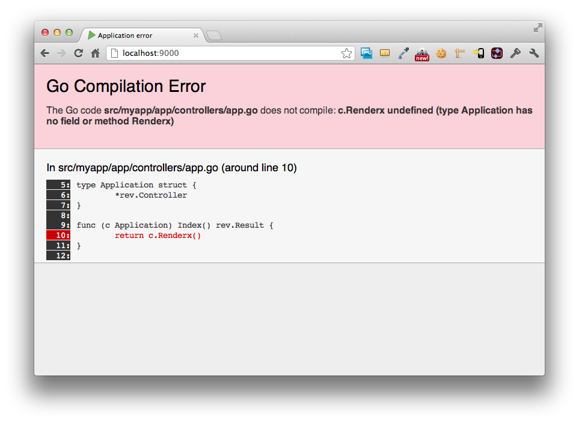
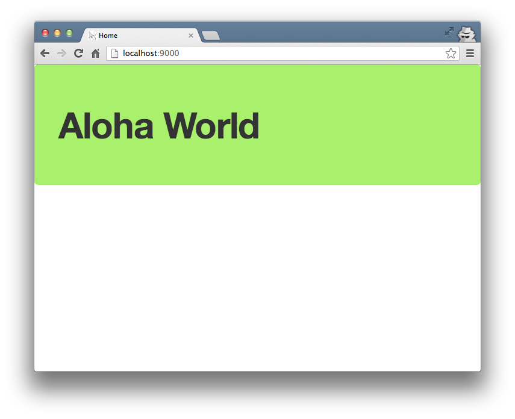

在[上一篇文章](createapp.html)中我们创建了一个叫做**myapp**的 Revel 程序。本篇文章中，我们将介绍 Revel 是如何处理发送到 http://localhost:9000/ 的HTTP请求并返回一个欢迎信息的。

### 路由(Routes)

Revel 首先要做的是检查 **conf/routes** 下的文件，自动生成的路由文件包含以下内容：

	GET     /                                       App.Index

这个配置的意思是，当收到一个**GET**请求，请求路径是 **/** 时，Revel将调用**App**控制器下的**Index**方法。

### 动作(Actions)

我们在 **app/controllers/app.go** 里找到这个方法：

	package controllers

	import "github.com/revel/revel"

	type App struct {
		*revel.Controller
	}

	func (c App) Index() revel.Result {
		return c.Render()
	}

所有的 Revel 控制器(controllers)必须是一个嵌入`*revel.Controller`的结构体（直接地或间接地）。而且`*revel.Controller`需要放在结构体的首位。在这个结构体相关联方法中，返回值是`revel.Result`类型的方法将被视为一个动作(Actions)。

Revel控制器提供了很多方法用于生成 Result 。在这个例子中，我们调用了 [`Render()`](../docs/godoc/controller.html#Controller.Render) 方法，作用是让Revel寻找合适的模板渲染，并返回给客户端(**200 OK**)。

### 模板(Templates)

所有的模板都保存在 **app/views** 文件夹中。如果不明确指明模板的名字，Revel会默认以动作名称来匹配模板。在这个例子中，Revel会自动查找 **app/views/App/Index.html** 文件，并将其作为[Go 模板](http://www.golang.org/pkg/html/template) 来渲染。以下是这个模板的内容：



	{{set . "title" "Home"}}
	{{template "header.html" .}}

	<header class="hero-unit" style="background-color:#A9F16C">
	  

	    

	      

	        <h1>It works!</h1>
	        

	      

	    

	  

	</header>

	

	  

	    

	      {{template "flash.html" .}}
	    

	  

	

	{{template "footer.html" .}}



除了 Go 模板本身提供的功能， Revel 还添加了[少量有用的功能](../manual/templates.html)。

这个模板非常简单，它做了：

1. 添加了一个新的模板相关变量 **title** 。
2. 包含了 **header.html** 模板（此模板用到了title变量）。
3. 显示一个欢迎信息。
4. 包含了 **flash.html** 模板，用来显示快捷信息。
5. 包含了 **footer.html** 模板。

如果查看 header.html，你会发现更多的模板标签：



	<!DOCTYPE html>

	<html>
	  <head>
	    <title>{{.title}}</title>
	    <meta http-equiv="Content-Type" content="text/html; charset=utf-8">
	    <link rel="stylesheet" type="text/css" href="/public/css/bootstrap.css">
	    <link rel="shortcut icon" type="image/png" href="/public/img/favicon.png">
	    
	    {{range .moreStyles}}
	      <link rel="stylesheet" type="text/css" href="/public/{{.}}">
	    {{end}}
	    {{range .moreScripts}}
	      
	    {{end}}
	  </head>
	  <body>



可以看到通过模板标签设置了网页标题，还有通过模板标签遍历两个变量 **moreStyles** 和 **moreScripts**，来包含更多的JS脚本和CSS样式表。 

### 热部署

我们改变一下欢迎信息。在 **Index.html** 中，将

	<h1>It works!</h1>

改为

	<h1>Hello World</h1>

刷新你的浏览器，你会发现改变瞬间生效了！ Revel 会监控你模板的改变，并重新加载它。

Revel 监控：

* **app/** 下所有的Go代码
* **app/views/** 下所有的模板 
* 路由文件 **conf/routes**

改变以上任何的内容，Revel 都会马上更新运行的程序。下面我们马上实验一下：打开 **app/controllers/app.go** 并且故意写错。

修改

	return c.Render()

为

	return c.Renderx()

刷新页面，Revel会显示一个很有用的错误信息：

最后，我们给模板传递一些数据。

在 **app/controllers/app.go** 中，将：

	return c.Renderx()

改为：

	greeting := "Aloha World"
	return c.Render(greeting)

在 **app/views/App/Index.html** 中，将：



	<h1>Hello World</h1>



改为：



	<h1>{{.greeting}}</h1>



刷新页面，你会看到来自夏威夷语的问候。

**下一篇： [编写一个简单的 Hello World 程序](firstapp.html)。**
